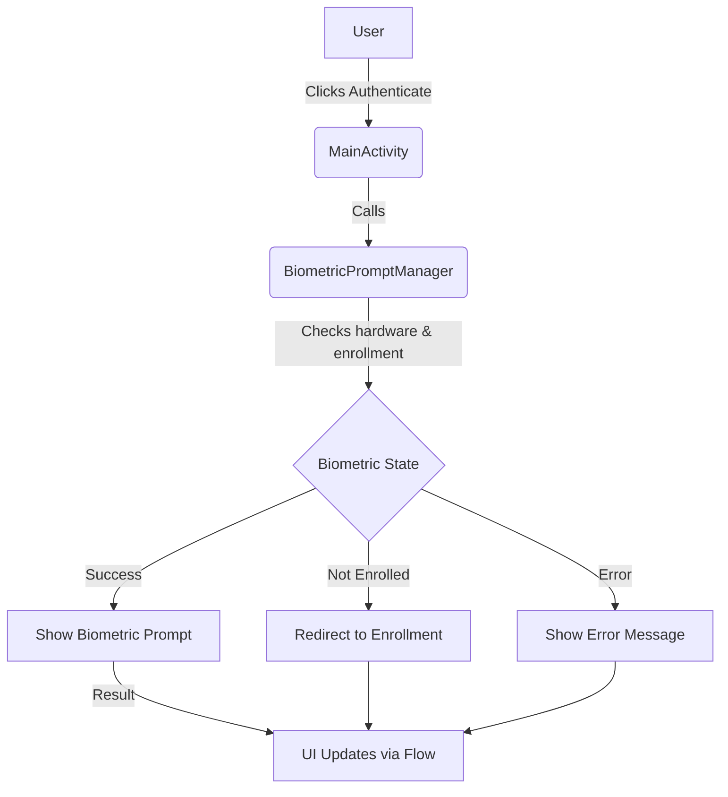
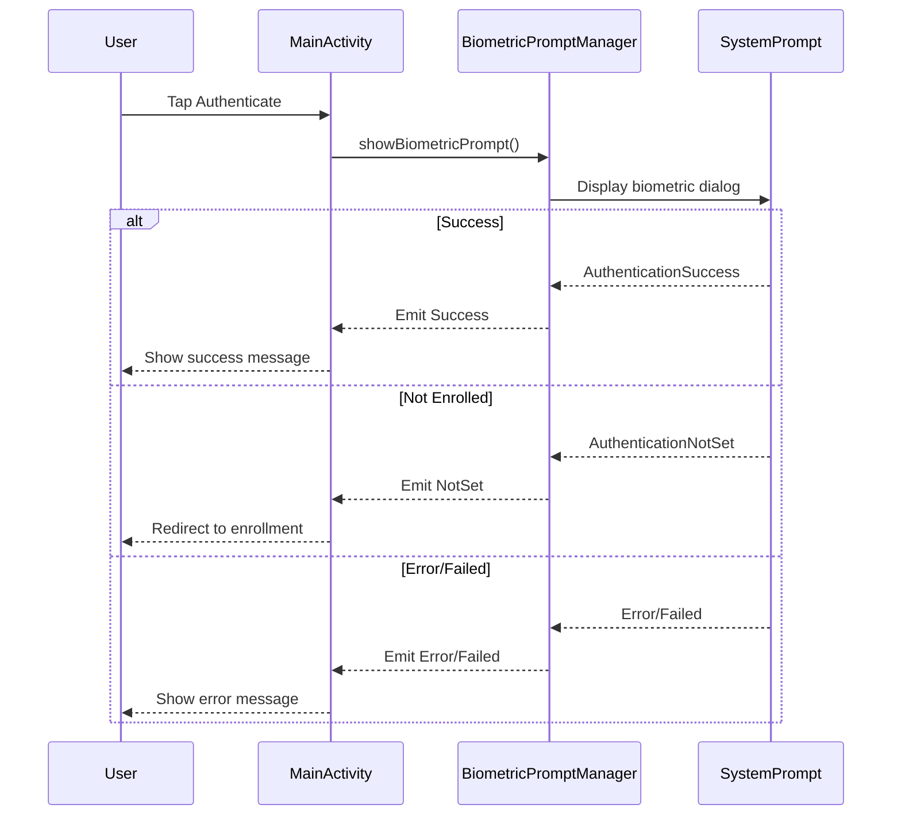

# Biometric Authentication on Android

## Overview
A modern Android demo app showcasing how to implement Biometric Authentication (Fingerprint, Face Unlock) for secure login using [Jetpack Compose](https://developer.android.com/develop/ui/compose) and the [AndroidX Biometric](https://developer.android.com/jetpack/androidx/releases/biometric) library. The app demonstrates best practices for integrating biometrics in a user-friendly, Material3-styled interface.

---

## Why Biometric Authentication?
- **Security:** Biometrics provide a strong, user-friendly alternative to passwords or PINs.
- **User Experience:** Fast, seamless authentication with minimal friction.
- **Modern Android:** Leverages the latest Android APIs and Compose for a future-proof implementation.

---

## How It Works
- **MainActivity**: Hosts the UI and triggers biometric authentication.
- **BiometricPromptManager**: Encapsulates all biometric logic, manages prompt display, and handles results via Kotlin Flows.
- **Jetpack Compose**: Used for all UI, ensuring a reactive, modern look and feel.
- **Material3 Theming**: Supports light/dark mode and dynamic color on Android 12+.

### Setup & Running
1. **Clone the repository:**
   ```bash
   git clone https://github.com/rugveddarwhekar/BiometricAuth.git
   cd BiometricAuth
   ```
2. **Open in Android Studio** (Giraffe+ recommended).
3. **Build & Run** on a device/emulator with biometric hardware (minSdk 26).
4. **Dependencies:**
   - AndroidX Biometric
   - Jetpack Compose
   - Material3

> No special permissions are required; the Biometric library handles all necessary checks.

---

## Features
- Biometric authentication (Fingerprint, Face Unlock)
- Graceful error handling (hardware unavailable, not enrolled, etc.)
- Redirects to enrollment if no biometrics are set up
- Modern Material3 UI with Compose
- Dynamic theming (light/dark, Android 12+ dynamic color)
- Clean architecture: separation of UI and biometric logic

---

## App Architecture



---

## Biometric Authentication Flow



---

## Screenshots
<p align="center">
  
  
  
</p>

---

## Learnings
- How to use AndroidX Biometric for secure authentication
- Integrating biometrics with Jetpack Compose and Kotlin Flows
- Handling edge cases: hardware errors, enrollment, and user cancellation
- Modern theming with Material3 and dynamic color

---

## Possible Improvements
- Add cryptographic operations (signing, encryption) post-authentication
- Support for custom fallback (PIN/Password)
- More granular error messages and analytics
- Unit/UI tests for biometric flows
- Multi-language support

---

## License
[MIT](LICENSE)
